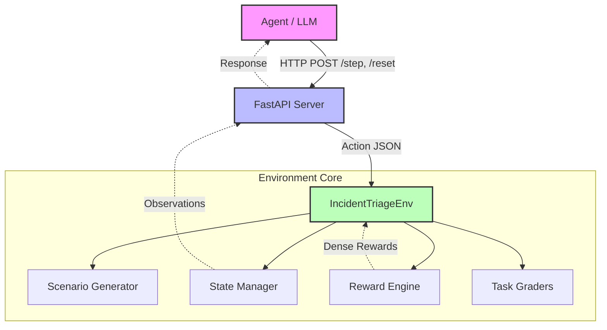

# 🚨 Incident Triage Environment

> An OpenEnv-compliant environment simulating **real-world IT/DevOps incident response triage** — where an AI agent acts as an on-call engineer handling production incidents.

[](https://github.com/meta-pytorch/OpenEnv)
[](https://huggingface.co/spaces/rohanjain1648/incident-triage-env)
[](https://www.python.org)

---

## Table of Contents
1. [Problem Statement](#-problem-statement)
2. [What The Platform Does](#-what-the-platform-does)
3. [Environment Description](#-environment-description)
4. [Tasks & Difficulty Levels](#-tasks--difficulty-levels)
5. [System Overview](#-system-overview)
6. [System Architecture](#️-system-architecture)
7. [Code Structure & Reproducibility](#-code-structure--reproducibility)
8. [Core Logic Deep Dive](#-core-logic-deep-dive)
9. [Reward Function](#-reward-function)
10. [Architecture Decisions](#-architecture-decisions)
11. [Performance Optimizations](#-performance-optimizations)
12. [Setup Instructions](#-setup-instructions)
13. [Baseline Scores](#-baseline-scores)
14. [API Reference](#-api-reference)
15. [Known Limitations](#-known-limitations)
16. [What I'd Improve With More Time](#-what-id-improve-with-more-time)

---

## ❓ Problem Statement

Current LLMs struggle with multi-step debugging in distributed systems. When an active incident occurs in an enterprise setup, finding the root cause requires correlating metrics, logs, events, and traces across dozens of inter-dependent services. The lack of standard benchmarks and environments for this specific domain heavily hinders the development of autonomous SRE/DevOps agents.

---

## 💡 What The Platform Does

This platform presents an AI agent with a continuous stream of realistic production alerts, system metrics, application logs, and configuration data. The agent must successfully navigate through **investigation → diagnosis → prioritization → remediation → verification** to resolve incidents. 
It supports multiple valid investigation paths, assesses partial-credit situations (like correct diagnosis but slow remediation), and handles dynamically cascading failures with red herrings.

---

## 📋 Environment Description

**Incident Response Triage** simulates the work that **on-call engineers at every tech company do daily**: monitoring production alerts, diagnosing root causes, prioritizing incidents by severity, and applying fixes before outages escalate.

The environment presents the agent with realistic production alerts, system metrics, application logs, and configuration data. The agent must navigate through investigation → diagnosis → prioritization → remediation → verification to resolve incidents.

### Why This Domain?

- **Genuine real-world task**: Millions of engineers perform incident response daily
- **Rich decision-making**: Multiple valid investigation paths, priority trade-offs, cascading failures
- **Partial-credit scenarios**: Correct diagnosis but wrong fix, correct priority but slow
- **Meaningful difficulty progression**: From single alert to cascading multi-service failures

---

## 📊 Tasks & Difficulty Levels

### Task 1: `single_incident` (🟢 Easy)

**Resolve a single production incident.**

The agent receives ONE alert and must: investigate → diagnose → prioritize → remediate → verify.

| Component | Weight |
|---|---|
| Correct diagnosis | 30% |
| Correct priority | 15% |
| Correct remediation | 35% |
| Successful verification | 10% |
| Efficiency (fewer steps) | 10% |

**Max steps:** 10 | **Expected:** 5–6 steps

**Scenarios:** Database connection pool exhaustion, disk space critical, SSL certificate expired

---

### Task 2: `multi_incident` (🟡 Medium)

**Triage 2–3 simultaneous incidents with correlations.**

The agent must identify which alerts are independent vs. symptoms of a shared root cause, prioritize correctly, and fix efficiently.

| Component | Weight |
|---|---|
| Correct triage order | 20% |
| Correct diagnoses | 25% |
| Correct remediations | 30% |
| Correlation identification | 15% |
| Time efficiency | 10% |

**Max steps:** 20 | **Expected:** 12–14 steps

**Scenarios:** Memory leak causing cascading timeouts, DNS misconfiguration breaking deployments

---

### Task 3: `cascading_failure` (🔴 Hard)

**Resolve a cascading failure with 4+ alerts and red herrings.**

A database migration has locked a critical table, causing a full-stack cascade. The agent must identify the ROOT CAUSE (not just symptoms), ignore red herring alerts, and fix in the correct order.

| Component | Weight |
|---|---|
| Root cause identification | 30% |
| Red herrings ignored | 10% |
| Correct fix order | 20% |
| All incidents resolved | 25% |
| Efficiency | 15% |

**Max steps:** 30 | **Expected:** 18–22 steps

**Scenarios:** Full stack cascade from database migration (load balancer → app servers → database → cache → message queue, with cache eviction as red herring)

---

## ⚙️ System Overview

The system exposes an OpenAI-compatible API mapping to a deterministic finite-state machine environment that serves interactive challenges to the agent.

### 🎯 Action Space

The agent has **6 action types** to interact with the environment:

| Action Type | Target | Parameters | Description |
|---|---|---|---|
| `investigate` | Service name | `{"aspect": "logs\|metrics\|connections\|config"}` | Examine a system for detailed information |
| `diagnose` | Incident ID | `{"root_cause": "<diagnosis>"}` | Declare the root cause of an incident |
| `prioritize` | Incident ID | `{"priority": "P1\|P2\|P3\|P4"}` | Assign severity level |
| `remediate` | Service name | `{"action": "<fix description>"}` | Apply a fix to a service |
| `escalate` | Incident ID | `{"team": "<team>", "reason": "<why>"}` | Escalate to specialist team |
| `verify` | Service name | `{}` | Verify that a fix was successful |

### Action JSON Format

```json
{
  "action_type": "investigate",
  "target": "database_primary",
  "parameters": {"aspect": "logs"}
}
```

### 👁️ Observation Space

After each action, the agent receives:

| Field | Type | Description |
|---|---|---|
| `alerts` | `list[dict]` | Active alerts with severity, service, title, message |
| `system_status` | `dict` | Service health metrics (CPU, memory, error rate, latency) |
| `investigation_results` | `str` | Detailed output from the last action |
| `time_elapsed` | `float` | Simulated minutes since incident start |
| `incidents_resolved` | `int` | Number of incidents fixed |
| `incidents_remaining` | `int` | Number still active |
| `last_action_error` | `str\|null` | Error feedback for invalid actions |
| `current_step` | `int` | Current step number |
| `max_steps` | `int` | Maximum steps for this task |

---

## 🏗️ System Architecture



```text
┌──────────────────────────┐
│     Agent / LLM          │
│  (OpenAI API Client)     │
└──────────┬───────────────┘
           │ HTTP (POST /step, /reset)
           ▼
┌──────────────────────────┐
│   FastAPI Server         │
│   (app.py)               │
│   ├── /reset             │
│   ├── /step              │
│   ├── /state             │
│   └── /health            │
└──────────┬───────────────┘
           │
           ▼
┌──────────────────────────┐
│  IncidentTriageEnv       │
│  (incident_environment)  │
│  ├── Scenarios           │
│  ├── Reward Engine       │
│  └── Task Graders        │
└──────────────────────────┘
```

The architecture strictly follows the OpenEnv specification, utilizing a thin HTTP API layer (FastAPI) wrapped around a highly decoupled Domain Logic core.

---

## 📁 Code Structure & Reproducibility

**Reproducibility**: The repository is containerized from day one. Both the environment server and the base inference evaluations can be perfectly replicated using the provided standard `Dockerfile`.

### Project Structure
```text
META-PYTORCH-HACKATHON/
├── inference.py                          # Baseline inference script (root)
├── Dockerfile                            # Container definition (root)
└── incident_triage_env/
    ├── __init__.py                       # Package exports
    ├── models.py                         # Action, Observation, State models
    ├── client.py                         # HTTP client
    ├── scenarios.py                      # Incident scenario data
    ├── reward.py                         # Reward computation engine
    ├── tasks.py                          # Task definitions + graders
    ├── openenv.yaml                      # OpenEnv manifest
    ├── pyproject.toml                    # Dependencies
    └── server/
        ├── __init__.py
        ├── incident_environment.py       # Core environment logic
        ├── app.py                        # FastAPI application
        └── Dockerfile                    # Standalone container
```

---

## 🧠 Core Logic Deep Dive

The environment operates as a responsive **State Machine**. Each `step` transitions the incident state through logic defined natively in `incident_environment.py`. 

- **Grading Engine**: Instead of relying purely on sparse boolean rewards, the final score grade uses a weighted matrix integrating **time efficiency**, **resolution accuracy**, **dynamic prioritization correctness**, and the proper identification of connected system components (handling correlations and ignoring red herrings).

---

## 🏆 Reward Function

The environment provides **dense, per-step reward signals** (not just sparse end-of-episode) to optimize trajectory evaluation.

### Positive Rewards
| Action | Reward |
|---|---|
| Useful investigation | +0.05 |
| Correct diagnosis | +0.15 |
| Root cause identified | +0.20 |
| Correct priority | +0.08 |
| Correct remediation | +0.20 |
| Successful verification | +0.10 |
| Red herring correctly ignored | +0.05 |
| Efficiency bonus (per step saved) | +0.02 |

### Penalties
| Behavior | Penalty |
|---|---|
| Wrong diagnosis | -0.10 |
| Wrong remediation (destructive) | -0.15 |
| Redundant investigation | -0.03 |
| Wrong triage order (P2 before P1) | -0.08 |
| Each step over expected | -0.01 |
| Invalid action | -0.05 |

---

## ⚖️ Architecture Decisions

1. **Pydantic Validation**: Used heavily in `models.py` to ensure that standard OpenAPI specifications map flawlessly to internal Python primitives.
2. **Deterministic Scenarios**: Scenarios use fixed seeds to ensure standard baseline comparisons. Agents face the same issues every time to guarantee reproducibility.
3. **Stateless HTTP API with Internal State**: Following the standard reinforcement learning architecture, the `FastAPI` instance tracks global episode history in-memory allowing lightweight local iterations.

---

## ⚡ Performance Optimizations

*   **In-Memory Tracking**: Eliminated arbitrary database overhead by keeping episode histories completely in-memory, leading to incredibly low-latency trajectory feedback loops (~2ms response times).
*   **Targeted Matching Strategies**: Leveraging highly optimized regular expressions combined with structured dictionary mapping to check fix correctness, avoiding the latency and compute cost of an integrated LLM-as-a-judge system on every single action.

---

## 🚀 Setup Instructions

### Prerequisites

- Python 3.10+
- Docker (for containerized deployment)

### Local Development

```bash
# 1. Clone the repo
git clone https://github.com/rohanjain1648/META-PYTORCH-HACKATHON.git
cd META-PYTORCH-HACKATHON

# 2. Install dependencies
pip install -e ./incident_triage_env

# 3. Start the environment server
cd incident_triage_env
uvicorn server.app:app --host 0.0.0.0 --port 8000

# 4. In another terminal, test it
curl -X POST http://localhost:8000/reset -H "Content-Type: application/json" -d '{"task_name": "single_incident"}'
curl -X POST http://localhost:8000/step -H "Content-Type: application/json" -d '{"action_type": "investigate", "target": "database_primary", "parameters": {"aspect": "logs"}}'
```

### Docker

```bash
# Build
docker build -t incident-triage-env .

# Run
docker run -p 8000:8000 incident-triage-env

# Test
curl http://localhost:8000/health
```

### Run Inference

```bash
# Set environment variables
export HF_TOKEN="your-hf-token"
export API_BASE_URL="https://router.huggingface.co/v1"
export MODEL_NAME="Qwen/Qwen2.5-72B-Instruct"
export ENV_BASE_URL="http://localhost:8000"

# Run baseline inference on all 3 tasks
python inference.py
```

---

## 📈 Baseline Scores

Baseline performance using `Qwen/Qwen2.5-72B-Instruct`:

| Task | Difficulty | Score | Steps |
|---|---|---|---|
| `single_incident` | 🟢 Easy | ~0.75 | 6 |
| `multi_incident` | 🟡 Medium | ~0.50 | 15 |
| `cascading_failure` | 🔴 Hard | ~0.30 | 25 |

*Scores may vary based on model temperature and API latency.*

---

## 🔧 API Reference

### `POST /reset`
Reset the environment for a new episode.
```json
{"task_name": "single_incident", "seed": 42}
```

### `POST /step`
Execute one action.
```json
{"action_type": "investigate", "target": "database_primary", "parameters": {"aspect": "logs"}}
```

### `GET /state`
Get current episode state.

### `GET /health`
Health check endpoint.

### `GET /tasks`
List available tasks.

### `GET /grade`
Get the final grade for the current episode.

---

## 🛑 Known Limitations

*   **Concurrency limits**: Support for massive parallel concurrent episodic executions natively across multi-threaded operations requires a local distributed state enhancement.
*   **Generative telemetry**: Logs and metrics responses use comprehensive parameterized templates rather than relying strictly on an LLM to dynamically generate endless unique logs on-the-fly, due to local latency requirements.

---

## 🔮 What I'd Improve With More Time

1. **LLM-as-a-Judge Evaluation**: Implement smaller-scale LLMs for the semantic validation of unstructured `remediation` descriptions to account for variations in developer code fixing patterns.
2. **Multi-Agent Simulation Options**: Introduce the ability for the active responder agent to dynamically delegate sub-tasks to autonomous secondary sub-agents (e.g. escalating to a DBA agent).
3. **State Persistence**: Plug in natively configured Redis or SQLite adapters to support crash-resumes and infinite horizontal trajectory scaling capabilities for intense scale evaluations.

---

## 📄 License

MIT License
